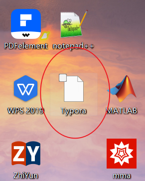

# Reset Icon Cache Script

## 简介
这个批处理脚本用于删除Windows系统中的图标缓存文件，并重启资源管理器。这可以帮助解决图标显示错误（变白纸）或损坏的问题。

## 文件描述
`ResetIconCache.bat` - 执行此脚本将删除 `IconCache.db` 文件并重启Windows资源管理器。

## 使用方法
1. 下载 `ResetIconCache.bat` 文件。
2. 右击文件`ResetIconCache.bat`并选择“使用记事本打开”。
3. 将文件`ResetIconCache.bat`中的 `[YourUsername]` 替换为您的计算机用户名。例如：`C:\Users\Jhon\AppData\Local\IconCache.db`。
4. 保存文件并关闭记事本。
5. 右击文件`ResetIconCache.bat`并选择“以管理员身份运行”。
6. 脚本将自动执行，无需进一步操作。

## 脚本效果

- 执行脚本前如下图所示：

- 执行脚本后如下图所示：

## 警告
- 在运行此脚本之前，请确保您已经保存了所有正在进行的工作，因为重启资源管理器将会关闭大多数打开的窗口。
- 此脚本将删除系统的图标缓存文件，通常这是安全的，但在极少数情况下可能会导致显示问题。
- 请确保您了解此脚本的操作，如果有疑问，请咨询IT专业人员。
